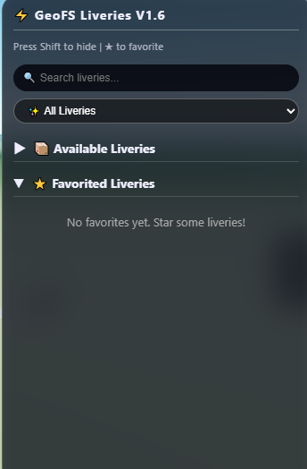

# GeoFS-liveries

This section contains all the unupdated liveries created by me and my friends. If you would like to contribute, please submit it to the issues section and indicate whether it is a real or virtual livery.

For any aircraft that supports livery switching, press the Shift key to display the livery list.

**If you have an idea for making a addon better, feel free to ask it in the [issues](https://github.com/8888CP/GeoFS-liveries/issues).**

# How to install this add-on?
**Method 1: JavaScript Console**
1. You can open the browser's inspection panel by using the keyboard shortcut **F12**, or by right-clicking anywhere on the webpage and selecting **"Inspect"** or **"Inspect Element"** from the context menu.
2. Open the JavaScript console and paste the [main.js](https://github.com/8888CP/GeoFS-liveries/blob/main/main.js) code into it

**Method 2: TamperMonkey**
This method only needs to be performed once. After that, the plugin will run automatically.

1. To the right of the list of files, click [releases](https://github.com/8888CP/GeoFS-liveries/releases/tag/1.5) to see the latest release.
2. Under the ***assets*** dropdown menu, click the first file (main.js) to download the script.
3. Follow the procedure on-screen to install the script.
> [!NOTE]
> After you save the script to Tampermonkey, it will automatically run each time you launch GeoFS.

# Aircraft with liveries
The list of supported aircrafts is:
- Airbus A319
- Airbus A319neo
- Airbus A320-214
- Airbus A320-232
- Airbus A320neo
- Airbus A321-211
- Airbus A321-232
- Airbus A321neo
- Airbus A330-200
- Airbus A330-900neo
- Airbus A340-300
- Airbus A350-900
- Airbus A350-1000
- Airbus A380
- ATR 72-600
- Boeing B737 MAX 8
- Boeing B737-600
- Boeing B737-700
- Boeing B737-800
- Boeing B737-900ER
- Boeing B747-400
- Boeing B747-8I
- Boeing B747-8F
- Boeing B747SP
- Boeing B757-200
- Boeing B767-300ER
- Boeing B767-400
- Boeing B777-200
- Boeing B777F
- Boeing B777-300ER
- Boeing B777-9X
- Boeing B787-9
- Boeing B787-10
- Bombardier CRJ 200
- Bombardier Dash 8 Q400
- Comac C919-100
- Embraer E175
- Embraer E190
- Embraer E190-E2
- Ilyushin IL-76TD

# Version: 1.6

- Added Favorites System
- Added Dual‑Pane View

# [Welcome join our discord!](https://discord.gg/VQuy54sQ)
